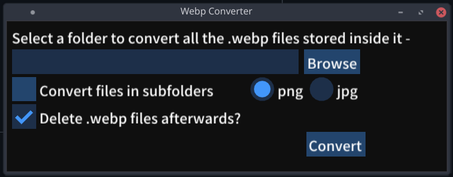

# webp-converter
PC Application to convert webp files to png or jpg files.

Has the following functionalities -
1. Single file conversion
2. Entire directory conversion 
3. Nested directory conversion
4. Option to delete the original webp files after conversion.

Built and tested on Linux.
